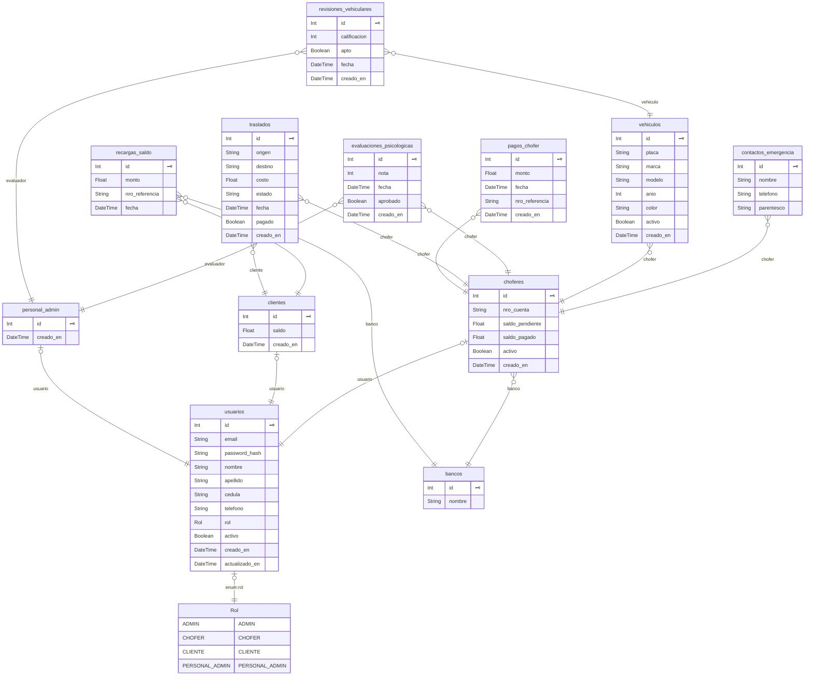

```mermaid
erDiagram

        Rol {
            ADMIN ADMIN
CHOFER CHOFER
CLIENTE CLIENTE
PERSONAL_ADMIN PERSONAL_ADMIN
        }
    
  "usuarios" {
    Int id "🗝️"
    String email 
    String password_hash 
    String nombre 
    String apellido 
    String cedula 
    String telefono 
    Rol rol 
    Boolean activo 
    DateTime creado_en 
    DateTime actualizado_en 
    }
  

  "choferes" {
    Int id "🗝️"
    String nro_cuenta 
    Float saldo_pendiente 
    Float saldo_pagado 
    Boolean activo 
    DateTime creado_en 
    }
  

  "contactos_emergencia" {
    Int id "🗝️"
    String nombre 
    String telefono 
    String parentesco 
    }
  

  "vehiculos" {
    Int id "🗝️"
    String placa 
    String marca 
    String modelo 
    Int anio 
    String color 
    Boolean activo 
    DateTime creado_en 
    }
  

  "evaluaciones_psicologicas" {
    Int id "🗝️"
    Int nota 
    DateTime fecha 
    Boolean aprobado 
    DateTime creado_en 
    }
  

  "revisiones_vehiculares" {
    Int id "🗝️"
    Int calificacion 
    Boolean apto 
    DateTime fecha 
    DateTime creado_en 
    }
  

  "clientes" {
    Int id "🗝️"
    Float saldo 
    DateTime creado_en 
    }
  

  "recargas_saldo" {
    Int id "🗝️"
    Float monto 
    String nro_referencia 
    DateTime fecha 
    }
  

  "traslados" {
    Int id "🗝️"
    String origen 
    String destino 
    Float costo 
    String estado 
    DateTime fecha 
    Boolean pagado 
    DateTime creado_en 
    }
  

  "pagos_chofer" {
    Int id "🗝️"
    Float monto 
    DateTime fecha 
    String nro_referencia 
    DateTime creado_en 
    }
  

  "bancos" {
    Int id "🗝️"
    String nombre 
    }
  

  "personal_admin" {
    Int id "🗝️"
    DateTime creado_en 
    }
  
    "usuarios" |o--|| "Rol" : "enum:rol"
    "choferes" |o--|| usuarios : "usuario"
    "choferes" }o--|| bancos : "banco"
    "contactos_emergencia" }o--|| choferes : "chofer"
    "vehiculos" }o--|| choferes : "chofer"
    "evaluaciones_psicologicas" }o--|| choferes : "chofer"
    "evaluaciones_psicologicas" }o--|| personal_admin : "evaluador"
    "revisiones_vehiculares" }o--|| vehiculos : "vehiculo"
    "revisiones_vehiculares" }o--|| personal_admin : "evaluador"
    "clientes" |o--|| usuarios : "usuario"
    "recargas_saldo" }o--|| clientes : "cliente"
    "recargas_saldo" }o--|| bancos : "banco"
    "traslados" }o--|| clientes : "cliente"
    "traslados" }o--|| choferes : "chofer"
    "pagos_chofer" }o--|| choferes : "chofer"
    "personal_admin" |o--|| usuarios : "usuario"
```
