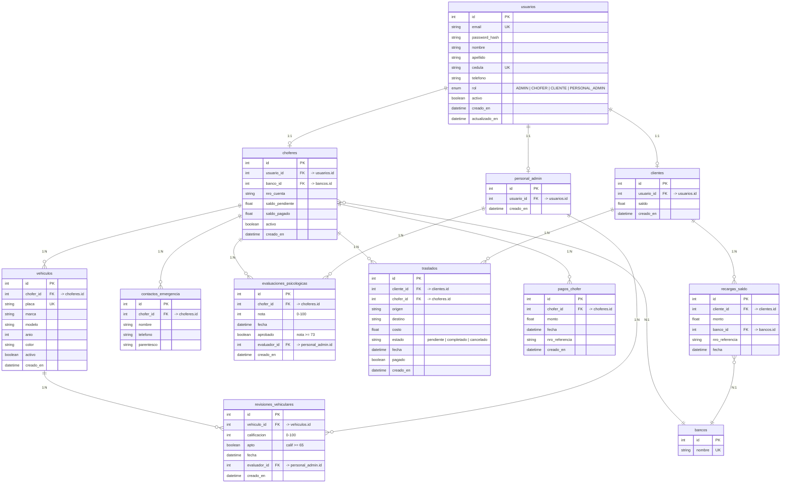

# Modelo Entidad-Relación — Decarrerita

## Leyenda

| Símbolo | Significado |
|---------|-------------|
| `||--o{` | 1 a muchos (relación 1:N) |
| `||--o|` | 1 a 1 (relación 1:1) |
| `}o--||` | Muchos a 1 (relación N:1) |
| `PK` | Clave primaria |
| `FK` | Clave foránea |
| `UK` | Unique (único) |
